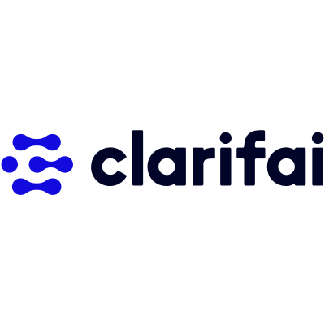
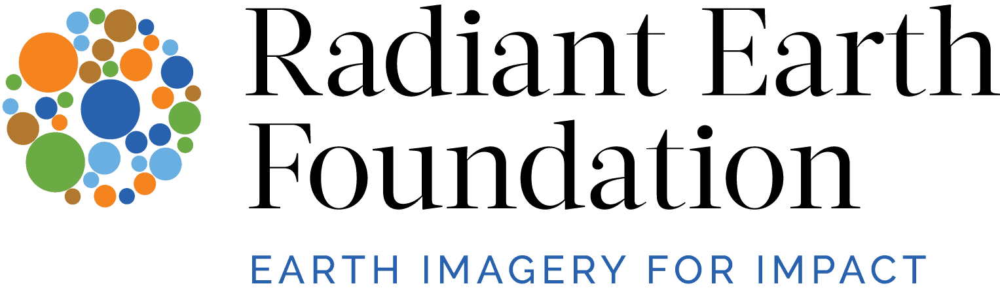
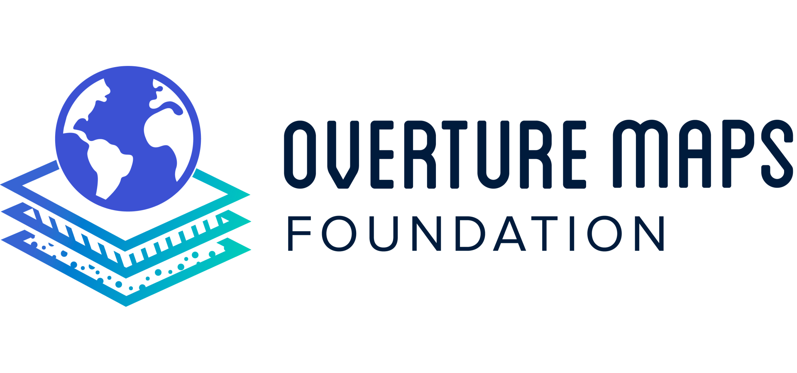

# About Me

I'm a research engineer supporting innovative work on multimodal foundation models, multidimensional data pipelines, and deep learning for CV/NLP.

My areas of focus have included ML weather forecasting, global map data generation, 3D photogrammetry, newspaper OCR, medical imagery analysis, geographic bias in vision classifiers, multilingual AI, and crowdsourcing.

I've worked in academic research environments, R&D labs, startups at various stages (including as a first hire), B corporations, and tech nonprofits. I have a Master's in Data Science from the University of Pennsylvania.

Always open to a new challenge!

    
    
    
    
    
    
    
    <!--  -->

